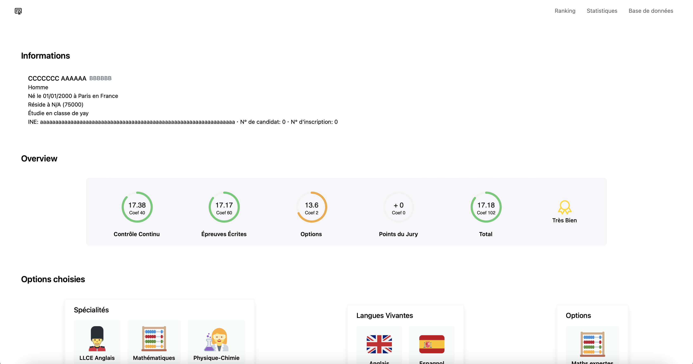
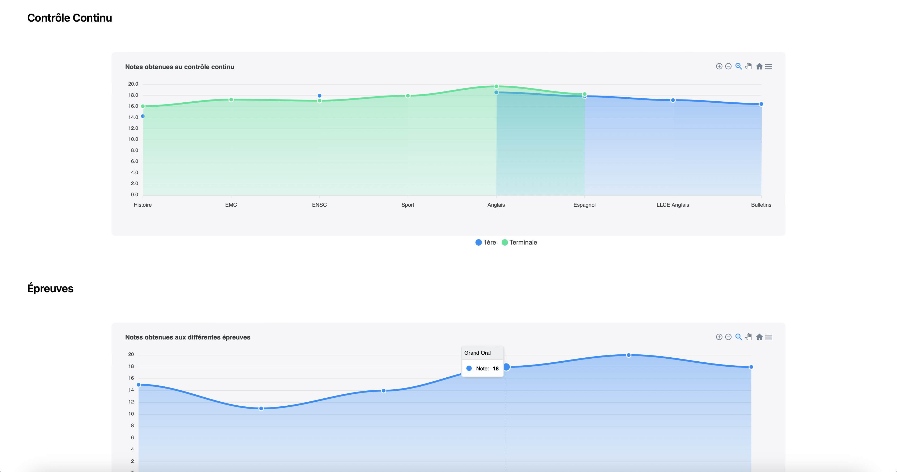

# bac

***Baccalauréat Data Extractor***

 
 

> **Warning**  
> This is currently not cleaned up and lots of things are still messy

## Index

- [Index](#index)
- [Usage](#usage)
  - [Parser](#parser)
  - [Website](#website)
    - [Screenshots](#screenshots)
- [Contributing](#contributing)
- [Authors](#authors)
- [Licensing](#licensing)

## Usage

### Parser

The main parser is under [parser/page.py](parser/page.py) if you want to use it.

It can parse the content of the PDFs provided with your Baccalauréat which summarizes all of your marks.

> **Warning**  
> A known issue would be that it is meant to use with the "Fillière Générale" baccalauréat and might not work with other baccalauréats

### Website

The website can nicely render the parsed results and even make statistics when multiple students are provided.

There is a live version of the website with the URL:

<https://anise-bac.vercel.app>

#### Screenshots

## Contributing

Pull requests are welcome. For major changes, please open a discussion first to discuss what you would like to change.

## Authors

- **Animenosekai** - *Initial work* - [Animenosekai](https://github.com/Animenosekai)

## Licensing

This software is licensed under the MIT License. See the [*LICENSE*](./LICENSE) file for more information.
